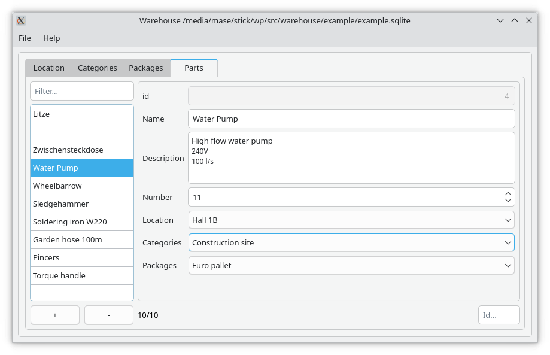

# Warehouse

Warehouse is a simple Qt interface. It dynamically creates an graphical form
from the structure of an SQLite database for the content of the same 
databse.

The form can add/remove/Edit datasets.

Example:


Use cases:
* Addressbooks
* Tiny warehouses / Inventory

## Database

The used database can be any SQLite file. All tables will apear as a tab in the 
gui. The colums will be shown as automaticaly generated Widgets. The rows will 
be shown in a table-view at the left of the tab.

Each table can contain foreign keys pointing other tables primary key.
E.g. if a column of table 'People' has the name "Cities_id_Name", it will be shown 
as a drop down widget 'Cities' with the names of all cities from table "Cities".

Some properties are hardcoded at the moment. E.g. when a column has the name 
"Description" it will automatically end up in an multi line text edit widget.

## Build

### Prerequisite

On an Debian based host systems, following packages must be installed:

* build-essential
* cmake
* qt6-base-dev

**Example for building:**
```shell
mkdir -p build
cd build
cmake ..
make -j$(nproc)
```

### Run the example

```shell
./warehouse ../example/example.sqlite
```

